  <html>
  <body>

  # **Team & Product Name**

  ### **`FeelEd`**

  # Information About Team and Product

  ## Team Members

  <table>
    <tr>
      <th></th>
      <th>Name</th>
      <th>Title</th>
      <th>Socials</th>
    </tr>
    <tr>
      <td></td>
      <td>Muharrem Sait Çoktaş</td>
      <td>Scrum Master</td>
      <td>
        
      </td>
    </tr>
    <tr>
      <td></td>
      <td>İkbal Gençarslan</td>
      <td>Product Owner</td>
      <td>
        
      </td>
    </tr>
    <tr>
      <td></td>
      <td>Muhammet Emin Bülbül</td>
      <td>Developer</td>
      <td>
        
      </td>
    </tr>
    <tr>
      <td></td>
      <td>Ayten Adiyan</td>
      <td>Developer</td>
      <td>
        
      </td>
    </tr>
    <tr>
      <td></td>
      <td>Süleyman Atman</td>
      <td>Developer</td>
      <td>
        
      </td>
    </tr>
  </table>

  ## Product Description
  FeelEd is an AI-powered, web-based educational platform designed to help students with visual impairments access and benefit from learning materials more effectively.
  We are aware of the challenges faced by visually impaired individuals in both traditional and digital educational environments, as well as the educational inequalities caused by inaccessible content. FeelEd's long-term goals are to eliminate barriers in education, support independent learning through inclusive design and artificial intelligence technologies, and promote digital equity by ensuring that educational tools are accessible regardless of visual ability.
  In doing so, we offer a socially impactful and scalable solution for individuals and institutions, while also fostering inclusive growth in the education sector. Among our core objectives are building a strong technological infrastructure based on accessibility standards, integrating AI in an ethical and reliable manner, and establishing robust collaborations with educators and accessibility experts.

  

    
<h2>Product Features</h2>

  <h3>Student & Teacher Login</h3>
    <ul>
        <li>Students and teachers can log in with interfaces tailored to their roles.</li>
        <li>Fully compatible design for screen readers for visually impaired users.</li>
        <li>Secure user authentication system (password + voice confirmation option).</li>
    </ul>
    <h3>Class Creation and Participation</h3>
    <ul>
        <li>Teachers can easily create digital classrooms and plan lessons.</li>
        <li>Students can quickly join with a class code.</li>
        <li>Audio-guided navigation helps visually impaired students join classes easily.</li>
    </ul>
    <h3>Classroom Management</h3>
    <ul>
        <li>Teachers can monitor student lists, attendance, grades, and individual progress.</li>
        <li>Students can access announcements, assignments, and lesson materials on the class board.</li>
        <li>The management panel supports both visual and audio access.</li>
    </ul>
    <h3>Assignment Control Page (Student & Teacher)</h3>
    <ul>
        <li>Students can upload assignments and track their status.</li>
        <li>Teachers can review assignments and give audio or written feedback.</li>
        <li>Voice-enabled assignment upload and feedback options are available for visually impaired students.</li>
    </ul>
    <h3>Access to Course Materials</h3>
    <ul>
        <li>Students can access all course content, books, presentations, and videos.</li>
        <li>Materials are offered with scalable fonts, high contrast, and simplified formats.</li>
    </ul>
    <h3>Audio Access to Course Materials (for Visually Impaired Students)</h3>
    <ul>
        <li>All written materials can be read aloud using text-to-speech (TTS) technology.</li>
        <li>Students can listen to materials and adjust speed, tone, and language preferences.</li>
    </ul>
    <h3>AI-Powered Question Solver</h3>
    <ul>
        <li>Students can ask questions they don't understand via text or voice.</li>
        <li>The AI system provides solutions tailored to the student's level.</li>
        <li>Voice assistant allows visually impaired students to use this feature independently.</li>
    </ul>

  
<h2>Target Audience</h2>

  <h3>1. Students</h3>
    <ul>
        <li><strong>Visually impaired students:</strong> Individuals at the primary, middle, and high school levels who need accessible digital content and assistive technologies.</li>
        <li><strong>Sighted students:</strong> Learners who develop empathy, cooperation, and collaborative learning skills by receiving education in inclusive learning environments alongside peers with different abilities.</li>
    </ul>
    <h3>2. Teachers and Educators</h3>
    <ul>
        <li>Teachers who aim to create appropriate materials and teaching methods for students with diverse abilities in the same classroom.</li>
        <li>Instructors, special education teachers, and guidance counselors who want to prepare accessible educational materials and integrate technology into the classroom.</li>
    </ul>
    <h3>3. School Administrators and Educational Institutions</h3>
    <ul>
        <li>School principals, private and public schools, and special education institutions that support inclusive education policies and aim to provide equal learning environments for students with different needs.</li>
    </ul>
    <h3>4. Families and Caregivers</h3>
    <ul>
        <li>Parents and guardians who want their children to learn in an equitable and accessible educational environment that meets their individual needs.</li>
    </ul>
    <h3>5. Public Institutions and NGOs</h3>
    <ul>
        <li>Government agencies, associations, and non-governmental organizations that support the participation of individuals with disabilities in society and advocate for their right to education, particularly in the fields of special education and accessibility.</li>
    </ul>

  

  

    
<h1>Sprint 1</h1>

  

    
<h3>Sprint 1 - Web Screenshots</h3>

  <table style="width: 100%;">
    <tr>
      <td colspan="4" style="text-align: center;"><h2>Authentication pages</h2></td>
    </tr>
    <tr>
      <td style="width: 100%;">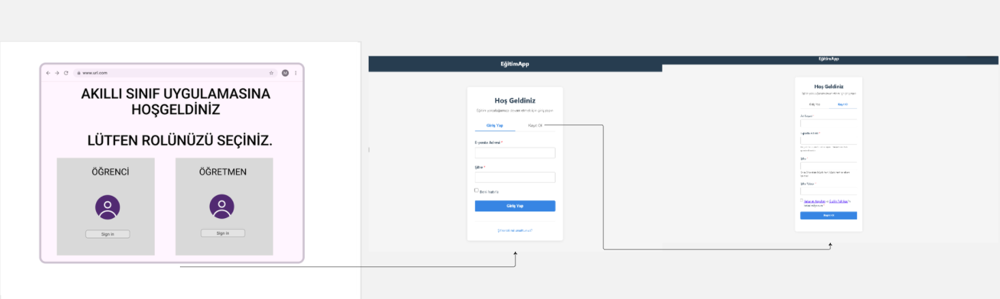</td>
    </tr>
    <tr>
      <td colspan="4" style="text-align: center;"><h2>Student Dashboard</h2></td>
    </tr>
    <tr>
      <td style="width: 50%;">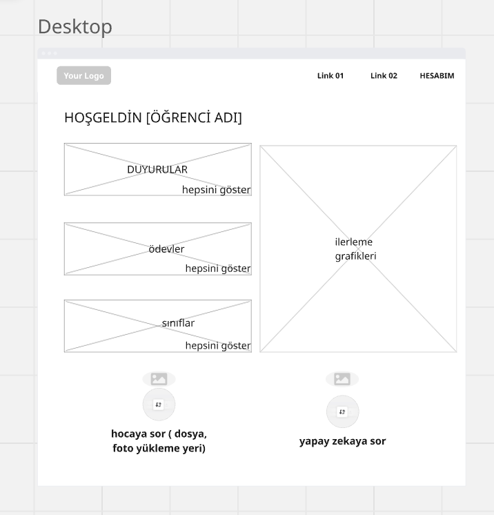</td>
      <td style="width: 50%;">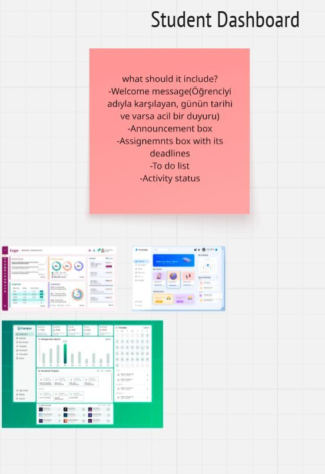</td>
    </tr>
    <tr>
      <td colspan="4" style="text-align: center;"><h2>Teacher Dashboard</h2></td>
    </tr>
    <tr>
      <td style="width: 50%;">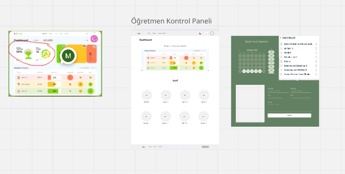</td>
      <td style="width: 50%;">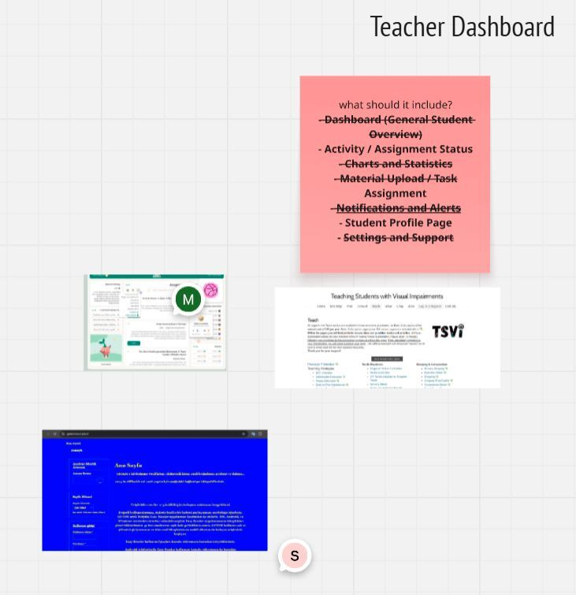</td>
    </tr>
    <tr>
      <td colspan="4" style="text-align: center;"><h2>Classroom Creation Page</h2></td>
    </tr>
    <tr>
      <td style="width: 25%;">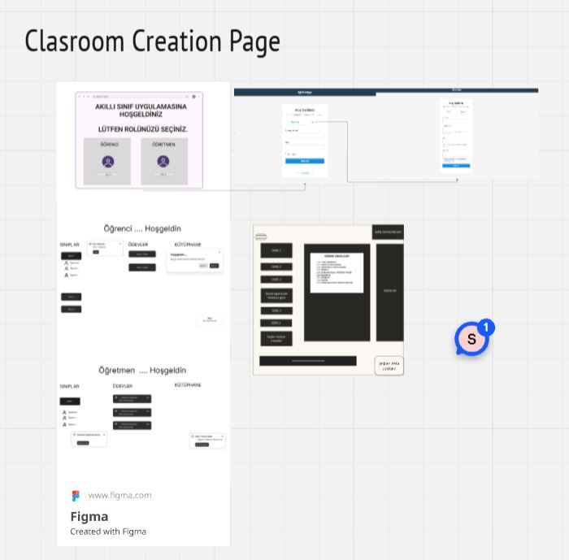</td>
    </tr>
  </table>
  
   

  

  
<h3>Sprint 1 - Website Map</h3>

  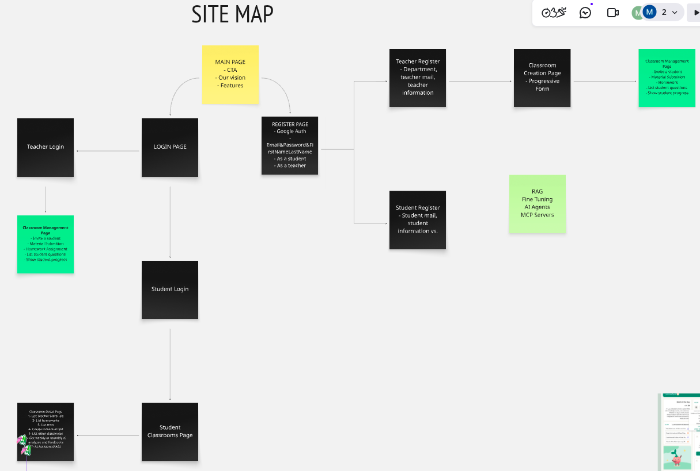
  

  

  
<h3>Sprint 1 - Project Management</h3>

  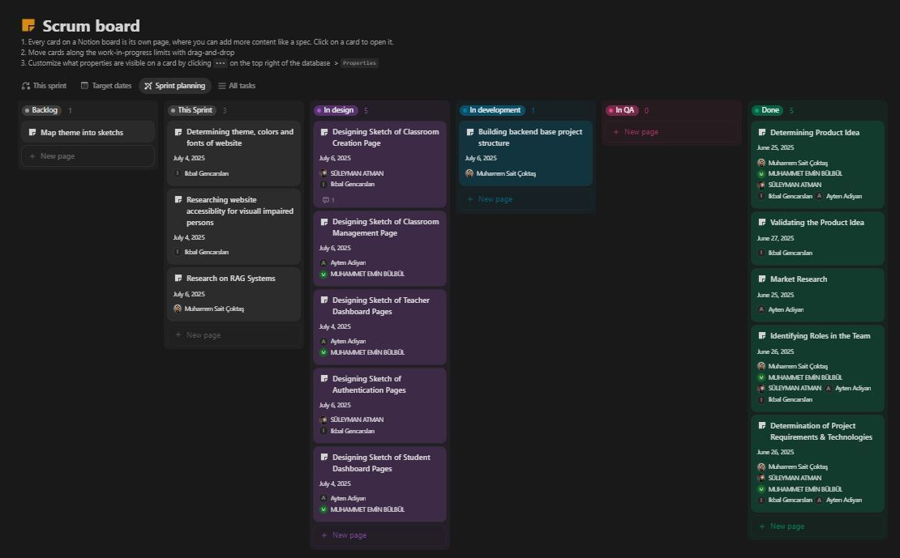
  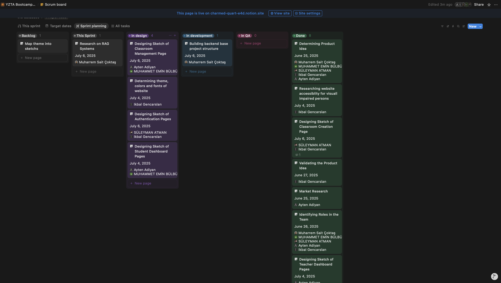
  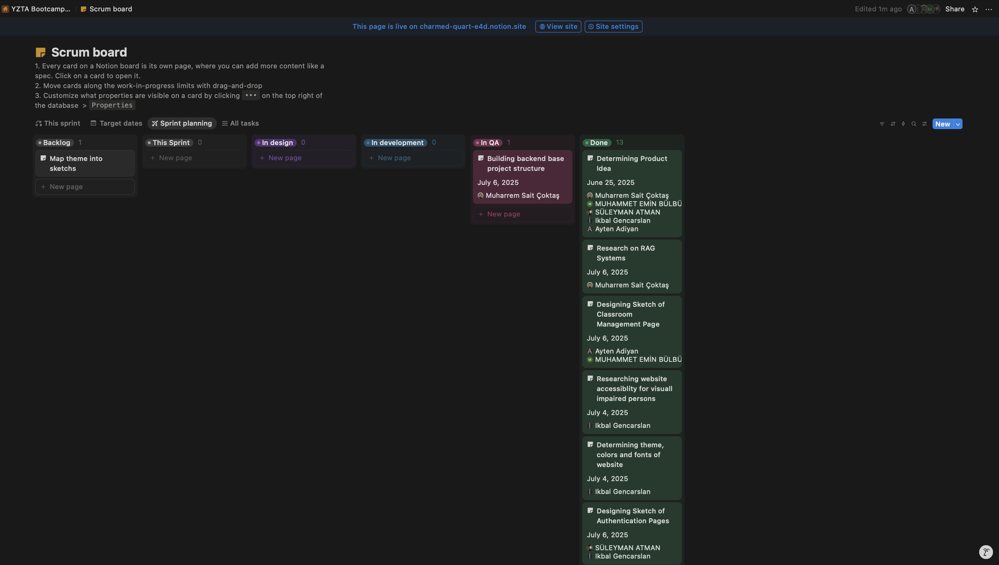
  

  

    
<h3>Sprint 1 - Burndown Chart</h3>

    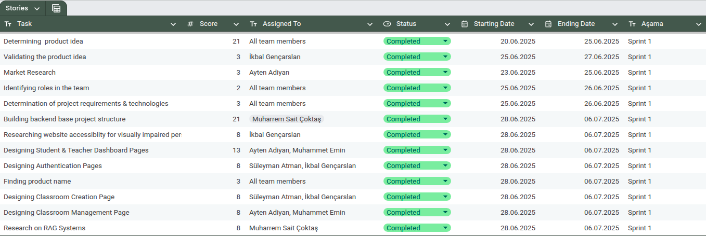
    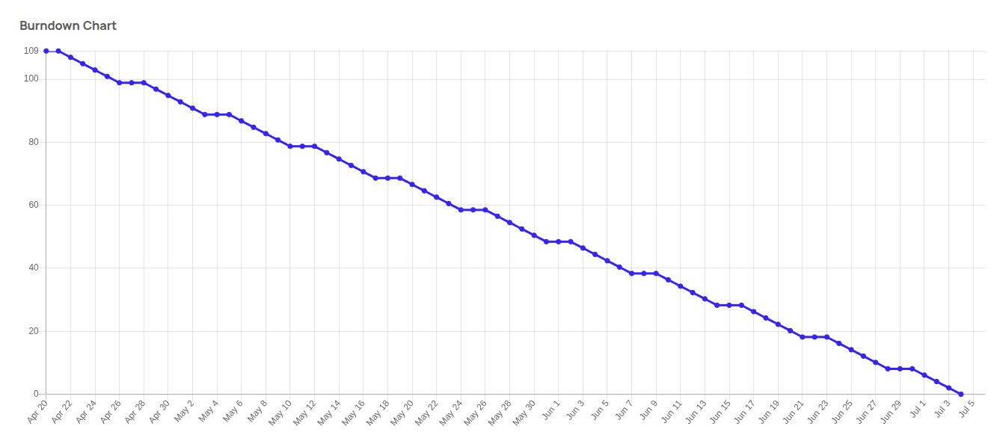
  

  - **Sprint Notes**:
    - It has been decided to use **Notion** for project management.
    - It has been decided to use **Figma** and **Miro** for UI designs.
    - It has been decided to use the **MVVM** structure for project architecture.
    * It has been decided to use **Vue.js** and **SCSS** for the frontend.
    * It has been decided to use **Express.js** for backend development.
    * It has been decided to use **MongoDB** with **Mongoose** for database management.
    * It has been decided to use **Google Authentication** for login and authorization.
    * It has been decided to implement both **email/password** and **Google Auth** login options.
    * It has been decided to use **Cloudinary** for file uploading.
    * It has been decided to integrate **AI tools** such as **Elevenlabs**, **Gen AI SDK**, and **RAG-based agents** for intelligent features.
    * It has been decided to use a **Vector Database** (**Pinecone**) to store indexed educational content.
    * It has been decided to implement **CRUD operations** and expose them via **REST API** endpoints.
    * It has been decided to design the platform as an **educational accessibility-focused website**.
    * It has been decided to include **Teacher**, **Student**, and **Admin** dashboards.
    * It has been decided to integrate **voice-based AI tutors** (RAG) for visually impaired students.
    * It has been decided to generate **weekly/monthly AI feedback** based on classroom interactions.
    * It has been decided to allow **classroom creation**, **student invitation**, **material upload**, **homework assignments**, and **progress tracking**.
    * It has been decided to develop a **multi-role registration system** (Student/Teacher) with progressive forms.
    * It has been decided to include the following pages in the frontend:
      * Main Page
      * Register Page
      * Login Page
      * Contact Page
      * Student Dashboard
      * Teacher Dashboard
      * Admin Dashboard
    * It has been decided to shortlist **DashSee** and FeedEd* as potential site names.
  - **Expected point completion within Sprint**: 109 points
  - **Point Completion Logic**: 
    - **Story Point Estimation**: Using Fibonacci sequence (1, 2, 3, 5, 8, 13, 21) for story point estimation
    - **Point Assignment Criteria**:
      - 1 point: Very simple tasks (5-15 minutes)
      - 2 points: Simple tasks (15-30 minutes)
      - 3 points: Small tasks (30-60 minutes)
      - 5 points: Medium tasks (1-2 hours)
      - 8 points: Large tasks (2-4 hours)
      - 13 points: Very large tasks (4-8 hours)
      - 21 points: Epic tasks (8+ hours, should be broken down)
    - **Completion Criteria**: A story is considered complete when:
      - All acceptance criteria are met
      - Code is reviewed and approved
      - Feature is tested and functional
      - Documentation is updated
      - No critical bugs remain
  - **Daily Scrum**: [Sprint 1 Daily Scrum](./readmeFiles/sprints/sprintOne/dailyScrum/)
  - **Product Backlog URL:** [Click for Backlog (Notion)](https://charmed-quart-e4d.notion.site/220b0bc6365b80a88297d43e8c960d37?v=220b0bc6365b8125bcbe000c047597bf&source=copy_link)
  - **Sprint Review:**
    - 

    * In the first sprint, we selected a team leader and decided on the tools we would use moving forward. We also defined some core user roles and agreed to continue with this structure in the next sprint.

    * We experienced some challenges when deciding on the main idea of the application. However, through team discussions, we managed to resolve these issues and established the foundation of the project.
    * While creating the themes and interface designs, we faced a few major difficulties. The final version of the design has not been completed yet, and we haven’t fully finalized the color palette either.
    * Throughout the process, we started using design tools like Figma and Miro more effectively, which helped improve our visual communication as a team.
    * In this sprint, we also made significant progress on the technical side. Most of the REST API structure and backend foundation was completed, providing a strong base for the development phase.
    * Overall, we accomplished all of our main goals for this sprint and created a solid plan for the next one.

  - **Sprint Review Participants:** `Muharrem Sait Çoktaş`, `Muhammet Emin Bülbül`, `Süleyman Atman`, `İkbal Gençarslan`, `Ayten Adiyan`
  - **Sprint Retrospective:**
    * The Main Page, Login Page, and Register Page will be developed using Vue.js. The pages will be designed to be desktop-oriented and web-compatible.
    * For user authentication, both email/password and Google login options will be integrated on the frontend and backend sides.
    * Student and teacher registration forms will be created. The steps and content of the form will change depending on the selected user role.
    * Backend APIs will be written for core features like creating classrooms, inviting students, and uploading materials.
    * Cloudinary integration will be implemented, allowing teachers to upload image and document-type content to the platform.
    * Data will be stored using MongoDB, and the system will be tested with example data entries.
    * A connection to the Pinecone vector database will be established, and several sample educational contents will be uploaded to the system.
    * AI tools (Elevenlabs, Gen AI SDK, RAG) will start being tested to develop the voice-based tutor feature.
    * Basic page structures for the Student, Teacher, and Admin dashboards will be developed using Vue.
    * The wireframes created in Figma and Miro will be further detailed. A web-focused color palette, typography, and icon set will be finalized.
    * Basic testing will be conducted on the developed components and pages, and any bugs will be reviewed.
  

    
  

  

  </body>
  </html>

